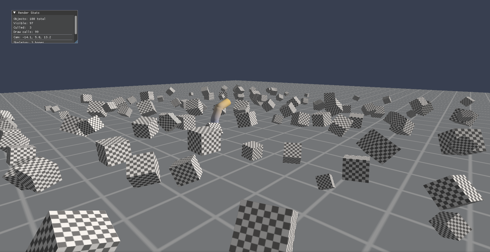
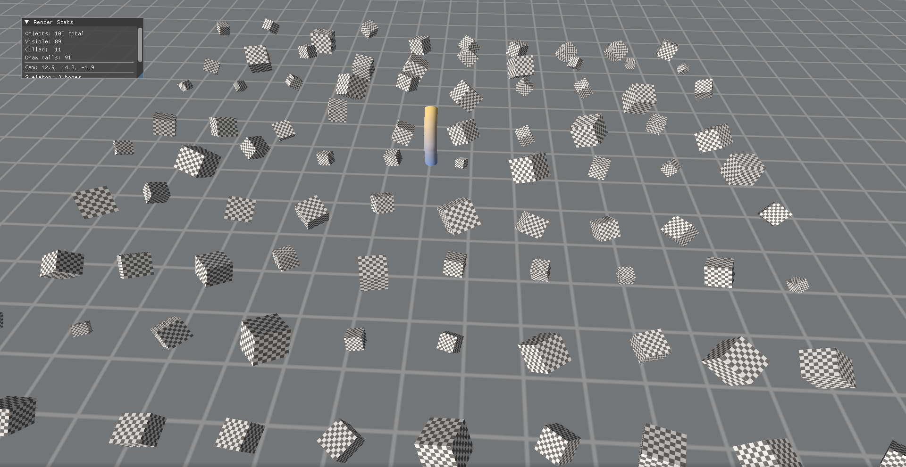

# SagaWiki

The canonical, current documentation for SagaEngine architecture, tooling, evidence, and product boundaries.

**Status:** SagaEngine is an active engine and authoring-toolchain codebase, not a finished game engine distribution. Statements here describe bounded repository capabilities; source, tests, manifests, and accepted evidence remain authoritative for their respective domains.

## Start here

Contributors should read [Getting started](getting-started.md), then the [module ownership rules](module-boundaries.md). Evaluators should pair the [current product position](product.md) with the explicit [not-implemented and non-claim boundaries](not-implemented.md).

## Direction

The long-term focus is creator-driven, self-hostable persistent community worlds with authoritative simulation, persistent state, modular gameplay packages, and C# source authoring. That direction is prioritization, not evidence that those product capabilities are complete.

## Repository snapshots

These images are bounded sandbox render evidence, not release screenshots.

